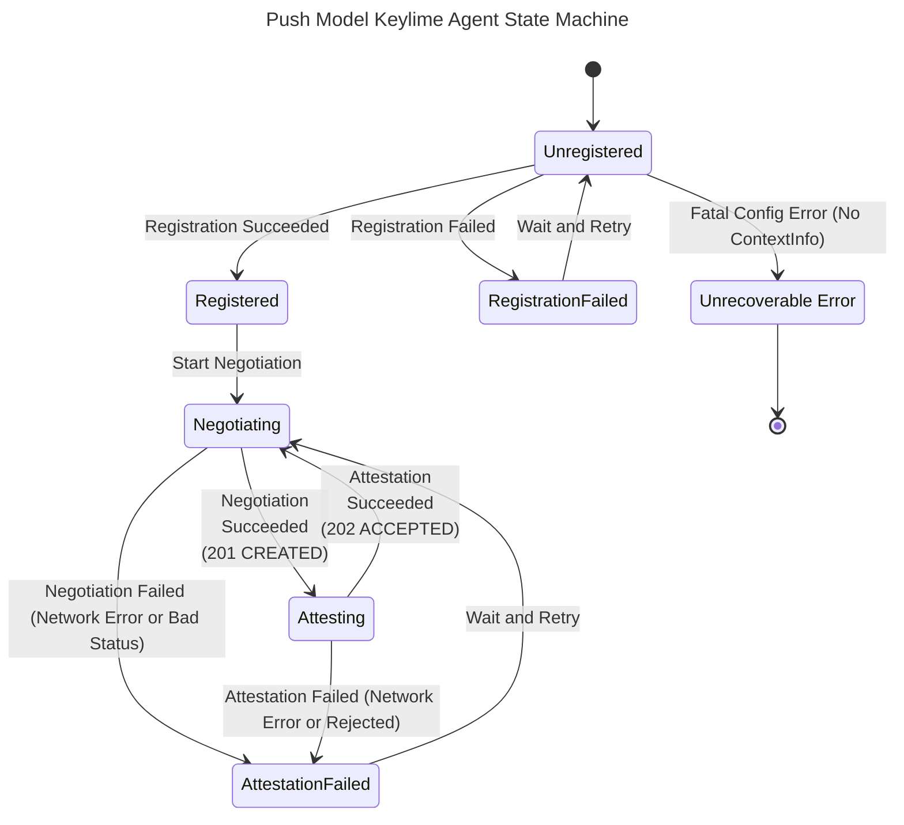

```mermaid
---
title: Push Model Keylime Agent State Machine
---
stateDiagram
  direction TB
  [*] --> Unregistered
  Unregistered --> Registered:Registration Succeeded
  Unregistered --> RegistrationFailed:Registration Failed
  Registered --> Negotiating:Start Negotiation
  Negotiating --> Attesting:Negotiation <br>Succeeded <br>(201 CREATED)
  Negotiating --> AttestationFailed:Negotiation Failed (Network Error or Bad Status)
  Attesting --> Negotiating:Attestation <br>Succeeded <br>(202 ACCEPTED)
  Attesting --> AttestationFailed:Attestation Failed (Network Error or Rejected)
  RegistrationFailed --> Unregistered:Wait and Retry
  AttestationFailed --> Negotiating:Wait and Retry
  Unregistered --> Failed:Fatal Config Error (No ContextInfo)
  Failed --> [*]
  Failed:Unrecoverable Error
```
